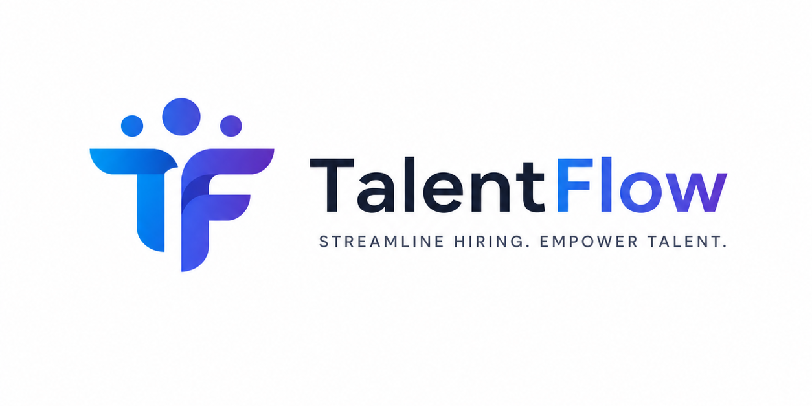

# TalentFlow — Company Recruitment Management System

A full-stack, internal recruitment management platform designed to streamline hiring workflows. TalentFlow provides HR teams with a centralized dashboard to track job postings, manage candidate pipelines, schedule interviews, and analyze recruitment metrics.

## 🚀 Features

* **HR Dashboard**: Real-time analytics, status distribution charts, and key performance indicators.
* **Job Management**: Create, edit, and categorize job postings with customizable requirements and salary bands.
* **Candidate Tracking**: Centralized candidate pool with resume uploads (PDF), and filtering by skills or experience.
* **Application Pipeline**: Kanban-style status tracking (Applied, Screening, Shortlisted, Interview, Offered, Hired, Rejected).
* **Interview Scheduling**: Track upcoming interviews, assign interviewers, and record structured feedback.
* **Role-Based Access**: Secured by JWT authentication (Single HR role for the initial release).

## 🛠️ Technology Stack

### Backend

* **Java 25** with **Spring Boot 4.0.6**
* **Spring Data JPA / Hibernate** for ORM
* **Spring Security** with **JJWT** for stateless authentication
* **MySQL** Database
* **Lombok** for boilerplate reduction

### Frontend

* **React 19** with **Vite**
* **React Router v7** for SPA navigation
* **Axios** for API integration
* **Recharts** for data visualization
* **Lucide React** for modern iconography
* **Vanilla CSS** featuring a premium dark theme, glassmorphism, and responsive layout

## 📋 Prerequisites

Before running the application, ensure you have the following installed:

* [Java Development Kit (JDK) 25](https://jdk.java.net/25/)
* [Node.js](https://nodejs.org/) (v18 or higher)
* [MySQL Server](https://dev.mysql.com/downloads/mysql/) (Running on default port `3306`)

## ⚙️ Setup & Installation

### 1. Database Configuration

Create the MySQL database. The Spring Boot application will automatically generate the schema upon startup.

```sql
CREATE DATABASE IF NOT EXISTS recruit_db;
```

*Note: The application defaults to username `root` and password `kishore2006`. You can modify these in `src/main/resources/application.properties`.*

### 2. Backend Setup

Navigate to the root directory and start the Spring Boot application using the Maven wrapper:

```bash
./mvnw spring-boot:run
```

* The backend server will start on `http://localhost:8080`.
* On the first run, a default admin user will be seeded into the database:
  * **Username**: `admin`
  * **Password**: `admin123`

### 3. Frontend Setup

Open a new terminal window, navigate to the `frontend` directory, install dependencies, and start the Vite development server:

```bash
cd frontend
npm install
npm run dev
```

* The React application will be available at `http://localhost:5173`.

## 📁 Project Architecture

### Backend (REST API)

The backend follows a standard N-Tier architecture:

* `controller/`: Exposes REST endpoints (`/api/jobs`, `/api/candidates`, etc.)
* `service/`: Contains core business logic and transaction management.
* `repository/`: Handles database interactions using Spring Data JPA.
* `entity/`: JPA models representing database tables.
* `dto/`: Data Transfer Objects for request/response mapping.
* `security/`: JWT token generation, validation, and request filtering.

### Frontend (React SPA)

* `api/`: Axios instances and service functions mapped to backend endpoints.
* `components/`: Reusable UI elements (Sidebar, Layout, Modal, StatusBadges).
* `context/`: React Context for global authentication state management.
* `pages/`: Core application views (Dashboard, Jobs, Candidates, Applications, Interviews).
* `index.css`: Global styling and design system tokens.

## 🔒 Security

* **Authentication**: Stateless JWT tokens passed via the `Authorization: Bearer <token>` header.
* **CORS**: Configured to allow cross-origin requests from the Vite development server (`http://localhost:5173`).
* **File Uploads**: Resumes are stored locally in the `uploads/resumes/` directory with UUIDs to prevent naming collisions.

---
*Built with ❤️ for efficient talent acquisition.*
